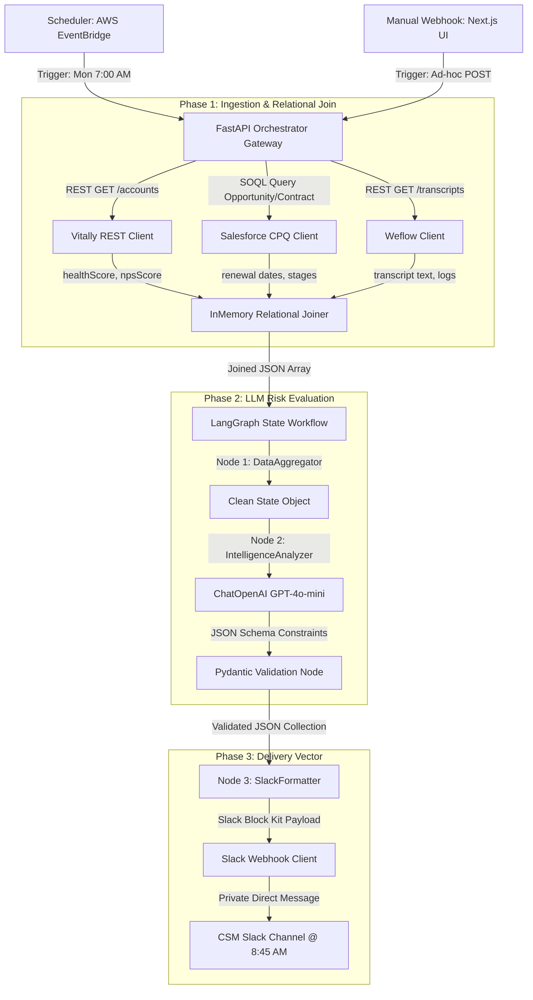

# Technical Design Document: Enterprise GTM Telemetry & Automation Engine

This document details the end-to-end architecture, database schema mapping, orchestration triggers, LLM synthesis rules, and notification delivery strategy for the CSM Monday Portfolio Intelligence Briefing.

---

## 🗺️ System Architecture Overview

The automation engine executes a three-phase pipeline: **Ingestion & Joins**, **Reasoning & Synthesis**, and **Delivery & Actions**. 



---

## 🕰️ Trigger Mechanisms

### 1. Chronological Trigger (Production)
* **Execution Source:** AWS EventBridge Scheduler (or a Serverless Cron Trigger).
* **Execution Time:** **Every Monday at 7:00 AM UTC/Local.**
* **The Failsafe Buffer Rationale:** Standups begin at 9:00 AM. Setting the trigger at 7:00 AM creates a **2-hour buffer**. This operational runway is a deliberate design choice that:
  1. Accounts for cold start sleep cycles of database connections.
  2. Absorbs potential network latency or API rate limits from Vitally and Salesforce gateways.
  3. Leaves sufficient time to trigger automated retries or fallback alert nodes if the LLM synthesis times out.

### 2. On-Demand Trigger (Operational)
* **Execution Source:** HTTP POST webhook endpoint exposed via `/api/trigger-digest`.
* **Execution Context:** Exposed directly in the Next.js control panel to allow CSMs to run manual mid-week refreshes immediately prior to client reviews or escalations.

---

## 🔌 Data Source Ingestion & Schema Mapping

The engine performs a deterministic relational join across three distinct sources using the common field `accountId`:

```
           [Vitally REST API]             [Salesforce CPQ SOQL]
             (accountId)                       (accountId)
                  \                                 /
                   \                               /
                [Unified Join Node] === (accountId) === [Weflow Logs]
```

### 1. Vitally (Product Health Database)
* **Ingestion Method:** REST API Client `GET /v1/accounts?csmId={csm_id}`.
* **Fields Extracted:**
  * `accountId` (string, Primary Key: e.g. `ACC_001` - used for relational joins)
  * `companyName` (string: Client identity)
  * `healthScore` (float, Range 0.0 - 10.0: Represents real-time product usage trends)
  * `npsScore` (integer, Range -100 to 100: Represents qualitative user feedback)

### 2. Salesforce CPQ (Commercial Opportunity & Timeline)
* **Ingestion Method:** Salesforce REST API executing SOQL (Salesforce Object Query Language) against CPQ objects:
  ```sql
  SELECT ContractEndDate, RenewalOpportunityStage, arrValue, ContractId 
  FROM Account_Contract_Join 
  WHERE AccountId = :accountId
  ```
* **Fields Extracted:**
  * `contractEndDate` (date, YYYY-MM-DD: Contract expiration date)
  * `renewalOpportunityStage` (string: Renewal progression status, e.g. `Discovery`, `Negotiation`, `Closed Won`)
  * `arrValue` (decimal: Contract valuation ARR)

### 3. Weflow (Conversational Intelligence & Logs)
* **Ingestion Method:** REST API call to fetch recorded customer interactions logged within the prior 7 days.
* **Fields Extracted:**
  * `transcriptSummary` (string: AI-summarized transcript text highlighting product issues, customer complaints, or renewals)
  * `escalationFlag` (boolean: True if customer explicitly requested support escalation or contract review)
  * `lastInteractionDate` (date, YYYY-MM-DD)

---

## 🧠 The LLM Synthesis Engine

### 1. Context Input
The LLM receives a structured JSON payload combining the unified telemetry metrics. Example input payload:
```json
{
  "csmId": "CSM_MARK_R",
  "accounts": [
    {
      "accountId": "ACC_001",
      "companyName": "Acme Corp",
      "vitally": { "healthScore": 3.8, "npsScore": 4 },
      "salesforce": { "renewalOpportunityStage": "Reviewing Competitor", "contractEndDate": "2026-06-25", "arrValue": 185000 },
      "weflow": { "transcriptSummary": "Exec sync. Champion left. New leadership reviewing spending. Severe platform churn risk.", "escalationFlag": true }
    }
  ]
}
```

### 2. The Reasoning Workflow
The engine leverages LangGraph to enforce state validation:
* **Prompt Strategy:** The model is instructed to act as an elite Revenue Operations analyst. It is trained to perform **Compound Risk Analysis**: a low Vitally health score is a hazard, but a low health score *combined* with a renewal date within 30 days and a champion departure log in Weflow represents a **CRITICAL** risk.
* **Structured Output Constraint:** Enforced via Pydantic model declarations. If the LLM output violates the schema format, the parsing node triggers a verification exception and falls back to a rules-based deterministic parser for uptime protection.

### 3. Output Schema (Pydantic Model)
The expected JSON response is validated against the following structure:
```json
{
  "csmId": "CSM_MARK_R",
  "digests": [
    {
      "accountId": "ACC_001",
      "companyName": "Acme Corp",
      "riskLevel": "CRITICAL", 
      "commercialUrgency": "Renewal: 2026-06-25 (Stage: Reviewing Competitor)",
      "executiveSummary": "Champion departure identified. New leadership is actively reviewing alternative platforms. Churn risk is high.",
      "actionItems": [
        "Introduce new CSM to the champion replacement",
        "Deliver security compliance audit reports"
      ]
    }
  ]
}
```

---

## 📬 Delivery Mechanism & Justification

### 1. Delivery Channel: Private Slack Direct Message (DM)
The final synthesized briefing is formatted using **Slack Block Kit UI** and pushed to the CSM at **8:45 AM every Monday** (exactly 15 minutes before the standup).

### 2. Operational Rationale (Why Slack Over Email/Google Docs?)
* **Context Preservation (Anti-Context Switching):** CSMs inhabit Slack as their primary operational headquarters. Forcing them to open another tool (like email, Google Drive, or a separate SaaS portal) introduces cognitive friction and slows down Standup preparation.
* **Standing Up in Standups:** Delivering the digest 15 minutes before the standup ensures it is top-of-mind. It takes less than 2 minutes to review their 3 critical risks directly on Slack.
* **Tactile Interactivity:** Slack Block Kit enables interactive button layouts. A CSM can click "Notify AE" or "Settle Risk" directly within their Slack thread, executing API calls back to Salesforce without navigating away from the chat window.

---

## 🛡️ Edge Cases & System Resiliency

1. **OpenAI API Failures:** If the OpenAI API encounters rate limits (HTTP 429) or endpoint timeouts, the `IntelligenceAnalyzer` node automatically falls back to a deterministic, rule-based risk evaluation algorithm to ensure standup digests are generated on time.
2. **Missing Accounts Mapping:** If an account exists in Vitally but is missing SFDC opportunity details, the joiner maps default placeholder schemas and flags the mismatch in the LangGraph logs.
