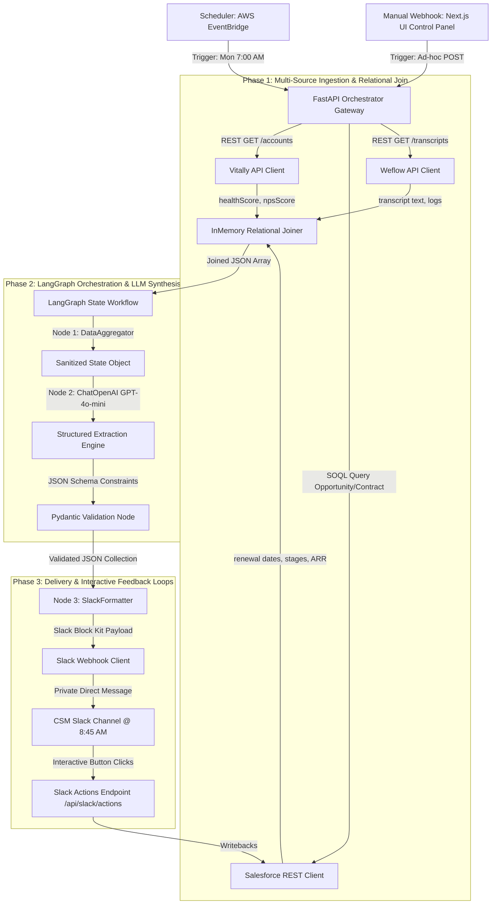

# 📐 Technical Design Document: Enterprise CSM Portfolio Automation Engine

This document details the end-to-end architecture, API integrations, data schemas, LLM synthesis rules, and delivery channels for the automated **Monday 8:45 AM Portfolio Intelligence Briefing**. It is written to be directly actionable for an engineering team to implement.

---

## 🗺️ System Topology & Flow

The automation engine executes a three-phase pipeline: **Ingestion & Relational Joins**, **Reasoning & Synthesis**, and **Interactive Slack Delivery**.



---

## 🕰️ 1. Trigger Mechanics & Orchestration

To guarantee delivery prior to the Monday 9:00 AM team standup, the orchestrator implements a dual-trigger mechanism:

### Chronological Trigger (Production)
* **Technology:** AWS EventBridge Scheduler (or a Serverless Cron Trigger).
* **Execution Time:** **Every Monday at 7:00 AM UTC/Local.**
* **The 2-Hour Failsafe Buffer Rationale:** 
  1. **API Rate Limiting:** Ingesting data for 100+ accounts across Salesforce, Vitally, and Weflow can trigger rate-limiting controls. The 2-hour window allows for automatic exponential backoff retries.
  2. **Cold Starts & Sleep Cycles:** Ensures serverless compute layers wake up and authenticate cleanly.
  3. **Fallback Synthesis:** If the primary LLM provider (OpenAI) experiences downtime or transient API timeouts, the scheduler has enough time to execute up to 3 retries or fallback to a deterministic rules-based scoring engine.

### On-Demand Trigger (Operational)
* **Technology:** HTTP POST webhook endpoint exposed via `/api/trigger-digest`.
* **Execution Context:** Exposed directly in the Next.js control panel to allow CSMs to run manual mid-week refreshes immediately prior to client reviews, executive escalations, or custom account syncs.

---

## 🔌 2. Data Source Ingestion & Relational Join Schema

The engine executes asynchronous HTTP calls to query and merge account metrics. The unified primary key for join resolution is the `accountId`.

```
           [Vitally REST API]             [Salesforce CPQ SOQL]
             (accountId)                       (accountId)
                  \                                 /
                   \                               /
                [Unified Join Node] === (accountId) === [Weflow Logs]
```

### 1. Vitally (Product Health Database)
* **Ingestion Method:** REST API Client `GET /v1/accounts?csmId={csm_id}`.
* **Fields Extracted:**
  * `accountId` *(string)*: Primary Key (e.g. `ACC_001` - used for relational joins).
  * `companyName` *(string)*: Human-readable client identity.
  * `healthScore` *(float)*: Range `0.0` - `10.0`. Represents real-time product usage trends.
  * `npsScore` *(integer)*: Range `-100` to `100`. Represents qualitative user feedback.

### 2. Salesforce CPQ (Commercial Opportunity & Timeline)
* **Ingestion Method:** Salesforce REST API executing SOQL against CPQ objects:
  ```sql
  SELECT ContractEndDate, RenewalOpportunityStage, arrValue, ContractId 
  FROM Account_Contract_Join 
  WHERE AccountId = :accountId
  ```
* **Fields Extracted:**
  * `contractEndDate` *(date, YYYY-MM-DD)*: Contract expiration date.
  * `renewalOpportunityStage` *(string)*: Renewal status (e.g., `Discovery`, `Negotiation`, `Closed Won`, `Reviewing Competitor`).
  * `arrValue` *(decimal)*: Contract valuation ARR.

### 3. Weflow (Conversational Intelligence & Logs)
* **Ingestion Method:** REST API call to fetch recorded customer interactions logged within the prior 7 days.
* **Fields Extracted:**
  * `transcriptSummary` *(string)*: Conversational summary highlighting product issues, customer complaints, or renewals.
  * `escalationFlag` *(boolean)*: True if customer explicitly requested support escalation or contract review.
  * `lastInteractionDate` *(date, YYYY-MM-DD)*.

---

## 🧠 3. The LLM Synthesis Engine (LangGraph)

### LLM Input Context
The LLM receives a structured JSON payload combining the unified telemetry metrics. Example input payload:
```json
{
  "csmId": "CSM_MARK_R",
  "accounts": [
    {
      "accountId": "ACC_001",
      "companyName": "Acme Corp",
      "vitally": { "healthScore": 3.8, "npsScore": 4 },
      "salesforce": { "renewalOpportunityStage": "Reviewing Competitor", "contractEndDate": "2026-06-25", "arrValue": 185000 },
      "weflow": { "transcriptSummary": "Exec sync. Champion left. New leadership reviewing spending. Severe platform churn risk.", "escalationFlag": true }
    }
  ]
}
```

### The Reasoning Workflow (Prompt Strategy)
The orchestrator triggers a ChatOpenAI agent running `gpt-4o-mini` with a structured reasoning system prompt. It is trained to perform **Compound Risk Analysis**: a low Vitally health score is a hazard, but a low health score *combined* with a renewal date within 30 days and a champion departure log in Weflow represents a **CRITICAL** risk.

#### System Prompt Template
```
You are an elite Revenue Operations and Customer Success AI Analyst. 
Your objective is to analyze a unified JSON payload representing a CSM's account book and generate a clear, highly-actionable intelligence briefing.

CRITICAL EVALUATION MATRIX:
1. stable: Health score > 7.0, no renewal within 90 days, transcripts positive.
2. elevated: Health score < 6.0 OR renewal within 60 days OR mild transcript risks.
3. critical: Health score < 5.0 AND renewal within 45 days OR active competitor discussions OR explicit escalation requests.

Generate an executiveSummary capturing the 'why' behind the risk status and extract concrete actionItems.
```

### Output Validation (Pydantic Model)
The output from the LLM is programmatically enforced using Pydantic validation:

```python
from pydantic import BaseModel, Field
from typing import List, Literal

class AccountDigest(BaseModel):
    accountId: str
    companyName: str
    riskLevel: Literal["CRITICAL", "ELEVATED", "STABLE"] = Field(
        description="The compound risk categorization based on health score, renew date, and transcripts."
    )
    commercialUrgency: str = Field(
        description="Summary of renewal date and contract stage."
    )
    executiveSummary: str = Field(
        description="Brief professional summary (max 3 sentences) explaining the classification."
    )
    actionItems: List[str] = Field(
        description="Up to 3 clear, actionable playbooks to mitigate risk or drive engagement."
    )

class PortfolioDigestCollection(BaseModel):
    csmId: str
    digests: List[AccountDigest]
```

---

## 📬 4. Delivery Channel: Interactive Slack DMs

### The Operational Rationale (Why Slack?)
* **Anti-Context Switching:** CSMs inhabit Slack as their primary operational headquarters. Forcing them to open another tool (like email, Google Drive, or a separate SaaS portal) introduces cognitive friction and slows down Standup preparation.
* **Timing & Focus:** Pushing the message at **8:45 AM Monday** (exactly 15 minutes before the standup) ensures it is top-of-mind. It takes less than 2 minutes to review their 3 critical risks.
* **Tactile Interactivity:** Slack Block Kit enables interactive button layouts. A CSM can click "Notify AE" or "Settle Risk" directly within their Slack thread, executing API calls back to Salesforce without navigating away from the chat window.

### Slack Block Kit Payload Example
The generated JSON is transformed into a Block Kit payload sent to the Slack Webhook API:

```json
{
  "channel": "U12345678",
  "blocks": [
    {
      "type": "header",
      "text": {
        "type": "plain_text",
        "text": "🚨 Monday Portfolio Intelligence Briefing",
        "emoji": true
      }
    },
    {
      "type": "section",
      "text": {
        "type": "mrkdwn",
        "text": "*Acme Corp* is flagged as *CRITICAL CHURN RISK*.\n*Health:* 3.8/10 | *ARR:* $185,000 | *Renewal:* 2026-06-25"
      }
    },
    {
      "type": "section",
      "text": {
        "type": "mrkdwn",
        "text": "*Executive Summary:* Champion departure identified. New leadership is actively reviewing alternative platforms. Churn risk is high."
      }
    },
    {
      "type": "actions",
      "elements": [
        {
          "type": "button",
          "text": {
            "type": "plain_text",
            "text": "💬 Ping Account Executive"
          },
          "style": "primary",
          "value": "action_ping_ae_ACC_001",
          "action_id": "ping_ae"
        },
        {
          "type": "button",
          "text": {
            "type": "plain_text",
            "text": "📁 Create Escalation Task"
          },
          "value": "action_create_escalation_ACC_001",
          "action_id": "create_escalation"
        }
      ]
    }
  ]
}
```

---

## 🛡️ Edge Cases & System Resiliency

1. **LLM Provider Outages (HTTP 500 / Timeout):**
   * **Mitigation:** The LangGraph state machine catches API exceptions. If the OpenAI API fails, the workflow redirects to a deterministic rule-based analysis node that classifies risk levels purely via threshold comparisons (e.g. `healthScore < 5.0` => `CRITICAL`) and populates templates for the summary.
2. **Schema Validation Exceptions:**
   * **Mitigation:** If the LLM returns an invalid JSON model that fails the Pydantic validator, the system executes an automated retry with a correction prompt. If the second attempt fails, it outputs the fallback deterministic payload to ensure the CSM receives their briefing.
3. **API Rate Limiting (Salesforce/Vitally):**
   * **Mitigation:** API clients are built using standard HTTP clients wrapped with a `tenacity` retry loop utilizing exponential backoff (`wait_exponential(multiplier=1, min=4, max=10)`).
