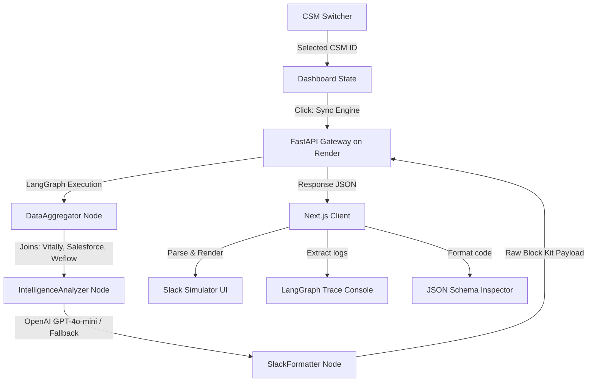

# 🖥️ Enterprise GTM Orchestration Console (Frontend)

[](https://nextjs.org/)
[](https://tailwindcss.com/)
[](https://langchain-ai.github.io/langgraph/)
[](https://vercel.com/)

This repository contains the premium, light-mode Next.js frontend interface for the **HG Insights GTM Automation Engine**. It serves as both a high-contrast RevOps Command Center and a live Slack Block Kit delivery simulator.

Designed specifically to address CSM cognitive load, it transforms complex relational data into a clean, actionable, and visual control panel.

---

## 🚀 Live Deployments
* **Live Workspace Dashboard (Vercel):** [https://frontend-xi-teal-29.vercel.app](https://frontend-xi-teal-29.vercel.app)
* **Live Orchestrator Backend (Render):** [https://gtm-automation-backend.onrender.com](https://gtm-automation-backend.onrender.com)

---

## 🛠️ Architecture & Data Flow



---

## ✨ Core Feature Depth

### 1. Dynamic Portfolio Routing & KPIs
* **7-CSM Roster Support:** The dashboard maintains state-management across all 7 Enterprise CSM portfolios (Mark Robinson, Sarah Jenkins, Alex Baldwin, Jessica Taylor, David Lang, Emily Chen, and Michael Wong).
* **Vivid Metrics Ribbon:** Instantly computes and showcases key portfolio metrics:
  * **Portfolio Size:** Active enterprise accounts under management.
  * **Managed ARR:** Sum of all active contract values.
  * **Portfolio Health Coefficient:** Saturated indicator bar charting average health.
  * **Contract Risk Pool:** The total sum of ARR currently tied to accounts flagged as `CRITICAL` risk.

### 2. Customer Success Details Hub
* **Account Directory List:** Displays accounts in a directory grid featuring health scores, sentiment badges, and contract details.
* **Salesforce CPQ Integration Card:** Highlights Renewal Opportunities, Contract End Dates, Stage analysis, and Key Executive contacts.
* **Conversation Intelligence (Weflow):** Pulls summarized transcripts of recent calls to give the CSM immediate qualitative context.

### 3. Consolidated Action Playbooks
* **Weflow Task Parsing:** Aggregates action items identified in conversation transcripts into a consolidated checkbox checklist.
* **Reactive Completion Tracker:** Features a custom progress bar mapping complete vs. pending tasks across the CSM's entire account pool.

### 4. High-Fidelity Slack App Simulator
* **Slack Client Mockup:** Recreates the Slack desktop experience with channel selectors (e.g. `#csm-intelligence-briefings`).
* **Interactive Block Kit Parser:** Translates standard Slack Block Kit JSON arrays into responsive visual cards (pulsing red cards for critical risks, yellow for elevated, green for stable) with functional action CTAs like "Notify AE" and "Acknowledge Alert" that support interactive emoji reactions.

### 5. Developer Tools
* **LangGraph Trace Logger:** A terminal console displaying step-by-step node execution, API invocation times, and pipeline state changes.
* **JSON Code Inspector:** A syntax-colored text viewer displaying the exact payload schema sent to the Slack Webhook Gateway, with a single-click "Copy JSON" button.
* **Escalation Email Generator:** Instantly pre-fills customer statistics, risk items, and playbooks into a draft email modal, enabling CSMs to review and send executive notifications.

---

## 💻 Tech Stack & Packages
* **Framework:** Next.js 16 (App Router, Turbopack enabled)
* **React Engine:** React 19 (supporting modern hooks and state models)
* **Styling:** Tailwind CSS v4 (incorporating mesh gradients, backdrop-filters, custom shadow glow, and animation-keyframes)
* **Icons:** Lucide React
* **HTTP Client:** Axios (for endpoint requests)

---

## 🏃 Getting Started

### Prerequisites
* Node.js v18+ 
* npm or yarn

### Installation
1. Clone the repository and navigate to the folder:
   ```bash
   git clone https://github.com/pyhrishi/gtm-automation-frontend.git
   cd gtm-automation-frontend
   ```

2. Install dependencies:
   ```bash
   npm install
   ```

3. Run the local development server:
   ```bash
   npm run dev
   ```

4. Open [http://localhost:3000](http://localhost:3000) in your browser.

### Build Verification
To compile and build a production-ready package:
```bash
npm run build
```
